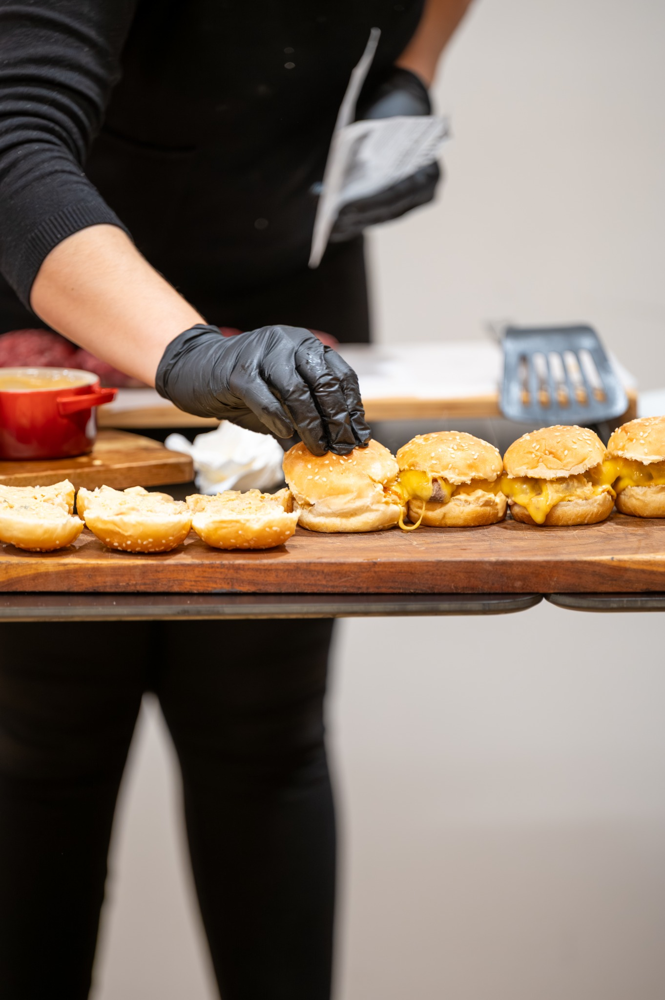
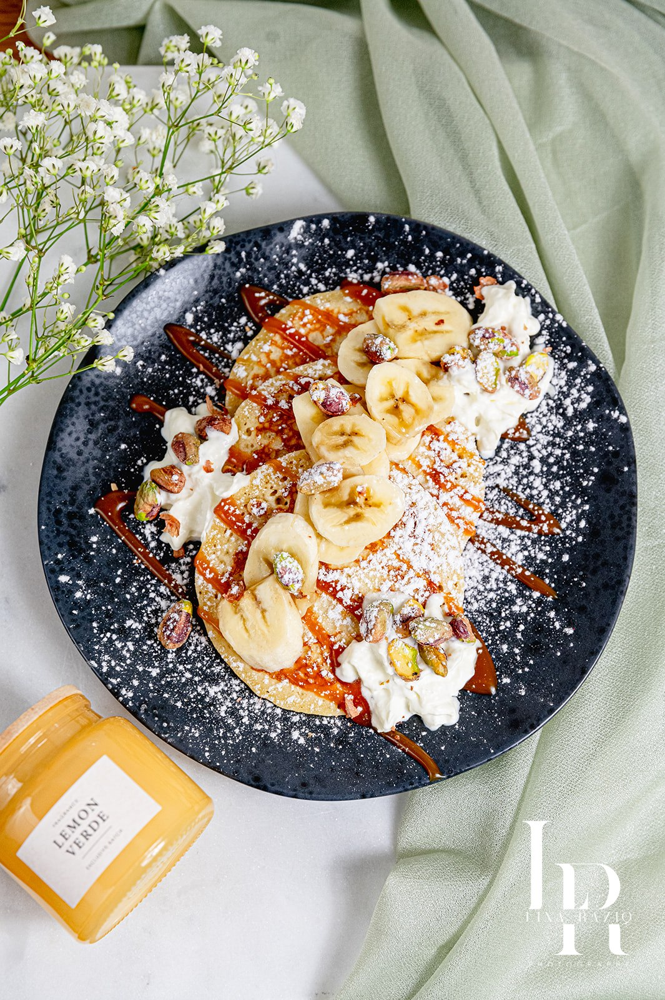
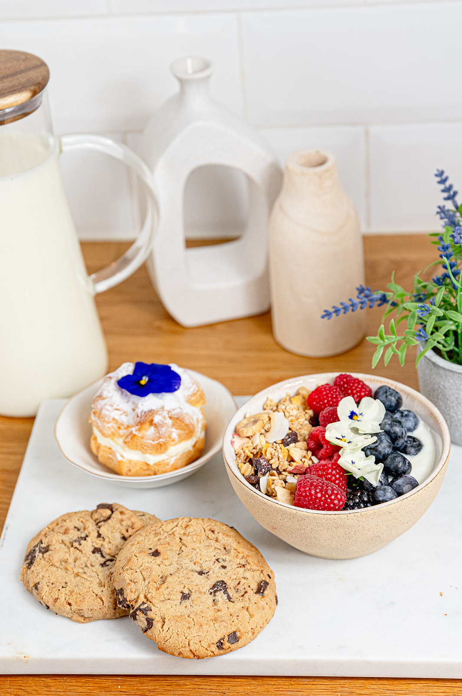
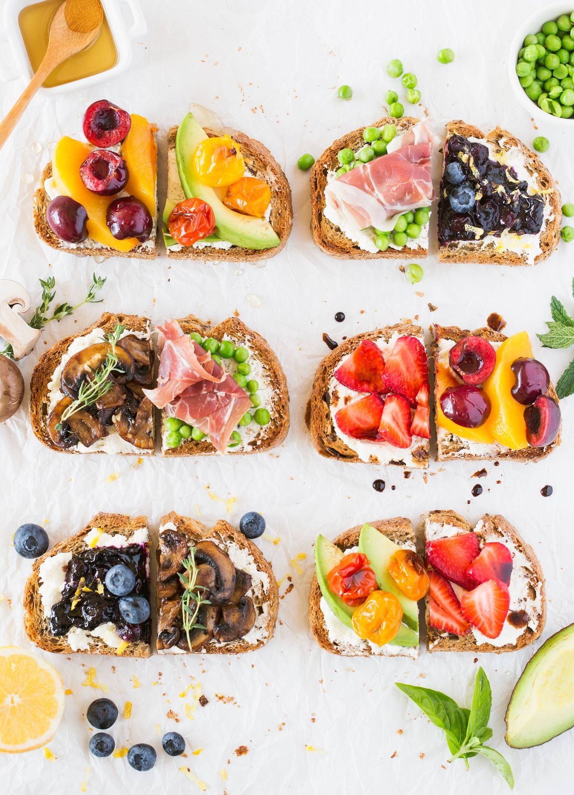
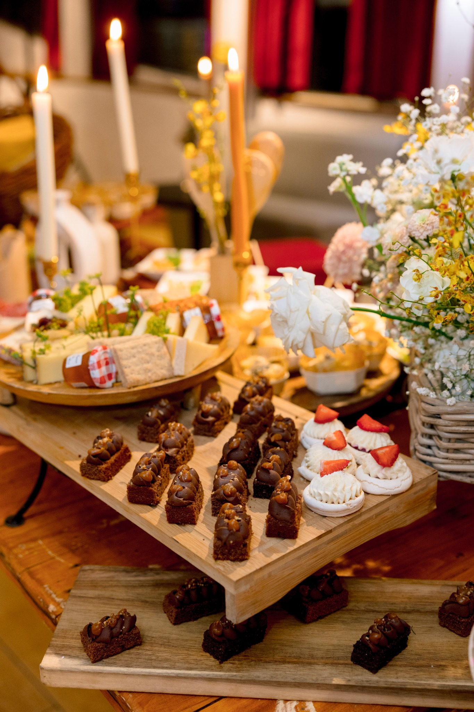

# REVIEW_CORRECTIONS_BRUNCH_CORPORATE — Amely Paris
## Corrections ciblées : brunch-buffets.html & corporate.html

**Date d'exécution :** 22 avril 2026  
**Périmètre :** 2 fichiers · 3 corrections · Zéro régression

---

## 1. Récapitulatif des interventions

| N° | Fichier | Zone | Opération |
|---|---|---|---|
| 01 | `brunch-buffets.html` | Section galerie | Suppression complète |
| 02 | `corporate.html` | Section process — titre | Suppression du h2 |
| 03 | `corporate.html` | Section process — contenu | Remplacement des 3 tiles par 3 grandes photos éditoriales |

---

## 2. Correction 01 — `brunch-buffets.html` : suppression de la section galerie

### Bloc supprimé

```html
<!-- GALERIE avec gap -->
<section class="section section--paper">
  <div class="container">
    <div class="section-head fade-in">
      <div><span class="kicker">Galerie</span><h2>En images.</h2></div>
      <a class="btn" href="realisations.html">Toutes les réalisations</a>
    </div>
  </div>
  <div class="gallery gallery--gap" style="padding:0 28px;">
    <a href="realisations.html"></a>
    <a href="realisations.html"></a>
    <a href="realisations.html"></a>
  </div>
</section>
```

### Résultat

La section a été intégralement supprimée. La page enchaîne désormais directement de la section "Composition type" vers la section CTA "Clé en main".

**Structure finale de `brunch-buffets.html` :**
```
Hero plein écran (vidéo hero-brunch.mp4)
  ↓
Section "Composition type" (3 compo-cards : Froid / Chaud / Sucré)
  ↓
Section CTA "Clé en main" (Installation · Décoration · Service)
  ↓
Pre-footer + Footer
```

### Non-régression

| Élément | Statut |
|---|---|
| Hero (vidéo, titre, CTA) | ✅ Intact |
| Section "Composition type" (3 compo-cards) | ✅ Intacte |
| Section CTA | ✅ Intacte |
| Header & Footer | ✅ Intacts |
| Images des compo-cards (charcuterie, salés, viennoiserie) | ✅ Présentes |

---

## 3. Correction 02 & 03 — `corporate.html` : refonte de la section process

### Avant — Section process complète supprimée

```html
<section class="section section--paper">
  <div class="container">
    <div class="section-head fade-in">
      <div>
        <span class="kicker">Process</span>
        <h2>Brief → Proposition<br>→ Repérage → Exécution.</h2>  ← SUPPRIMÉ
      </div>
      <a class="btn" href="contact.html">Démarrer un projet</a>
    </div>
    <div class="tiles">                                             ← SUPPRIMÉ
      <div class="tile fade-in">
        <div class="tile-media tile-media--medium">
          
        </div>
        <div class="tile-body">
          <span class="kicker">Matin</span>
          <h3>Petit-déjeuner<br>& Coffee break</h3>
          <a href="traiteur-formats.html#coffee" class="tile-link">Voir</a>
        </div>
      </div>
      <!-- + 2 tiles identiques Midi / Soir -->
    </div>
  </div>
</section>
```

### Après — Section process restructurée

```html
<section class="section section--paper">
  <div class="container">
    <div class="section-head fade-in">
      <div><span class="kicker">Process</span></div>
      <a class="btn" href="contact.html">Démarrer un projet</a>
    </div>
  </div>
  <div class="editorial editorial--3">
    <div class="ed-cell ed-cell--tall fade-in">
      
      <span class="ed-label">Petit-déjeuner &amp; Coffee break</span>
    </div>
    <div class="ed-cell ed-cell--tall fade-in">
      
      <span class="ed-label">Lunch box premium</span>
    </div>
    <div class="ed-cell ed-cell--tall fade-in">
      
      <span class="ed-label">Cocktail &amp; Finger food</span>
    </div>
  </div>
</section>
```

### Logique visuelle retenue

La présentation adoptée est **identique** à la section éditoriale sous le hero de cette même page :

```html
<!-- Référence visuelle — section sous le hero de corporate.html (intouchable) -->
<section class="section--flush">
  <div class="editorial editorial--3">
    <div class="ed-cell ed-cell--tall fade-in"><span class="ed-label">...</span></div>
    <div class="ed-cell ed-cell--tall fade-in"><span class="ed-label">...</span></div>
    <div class="ed-cell ed-cell--tall fade-in"><span class="ed-label">...</span></div>
  </div>
</section>
```

- Même classe container : `.editorial.editorial--3`
- Même proportion de cellule : `.ed-cell.ed-cell--tall`
- Même système de légende : `span.ed-label`
- Placé **hors du `div.container`** → rendu pleine largeur, identique à la référence
- Mêmes 3 images (sources inchangées, issues de `assets/common/shared/`)
- Animation `.fade-in` conservée

### Non-régression

| Élément | Statut |
|---|---|
| Hero (vidéo, titre, CTA) | ✅ Intact |
| Section éditoriale sous le hero (3 ed-cells) | ✅ Intacte |
| Banner text (Séminaire · Cocktail · ...) | ✅ Intact |
| Section "Impact" + CTA | ✅ Intacts |
| Header & Footer | ✅ Intacts |
| Kicker "Process" | ✅ Conservé |
| Bouton "Démarrer un projet" | ✅ Conservé |
| Images process (coffee-break, lunch-box, finger-food) | ✅ Présentes |
| CSS existant (.editorial, .ed-cell, .ed-label) | ✅ Aucun ajout nécessaire |

---

## 4. Bilan global — Règle de non-régression

| Fichier | Zones intouchables | Statut |
|---|---|---|
| `brunch-buffets.html` | Hero, compo-cards, CTA, header, footer | ✅ Toutes intactes |
| `corporate.html` | Hero, banner, editorial sous hero, section Impact, header, footer | ✅ Toutes intactes |
| `assets/css/style.css` | — | ✅ Non touché (classes `.editorial`, `.ed-cell`, `.ed-label` déjà présentes) |
| Autres pages du site | — | ✅ Non touchées |

**Aucune nouvelle classe CSS n'a été nécessaire.** Les classes `.editorial--3`, `.ed-cell--tall` et `.ed-label` existaient déjà dans le stylesheet.

---

*REVIEW_CORRECTIONS_BRUNCH_CORPORATE.md — Amely Paris — Généré le 22 avril 2026*
